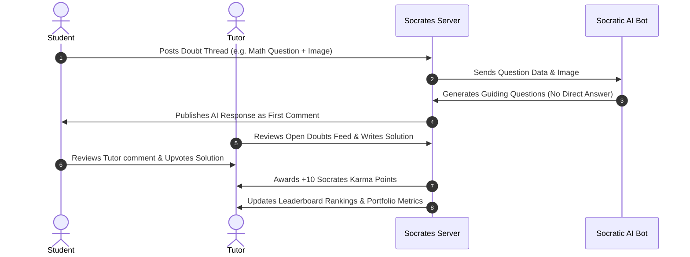

# SOCRATES: COMMUNITY KNOWLEDGE MARKETPLACE 🧑‍🎓👨‍🏫
## Non-Monetized, Async Reddit-Style Model

SOCRATES can be structured as a **non-monetized, asynchronous community tutoring marketplace**. It functions like a specialized Reddit or StackOverflow for education, combined with Socratic AI. 

No real money is involved. Instead, the platform is driven by **Reputation Karma**, **Gamification**, and **Public Portfolio Building**.

---

## 🗺️ 1. THE STUDENT PERSPECTIVE & JOURNEY (User Feed)

For students, Socrates is a free, crowdsourced doubt-clearing forum where they can post homework blockers, discuss problems with peers, and get guided help from AI and certified human tutors.

### 🧑‍🎓 Student Journey Map:
```
[Sign Up & Subjects] ➔ [Post a Doubt Thread] ➔ [AI Assistant Reply] ➔ [Tutors Comment / Solve] ➔ [Upvote Best Answer] ➔ [Save to Notebook]
```

### 📋 Student Feature Catalog:

#### 1. Learning Profile Setup
* **What it does:** Students register, select their study subjects (e.g. Physics, Coding), and create a personal learning feed.
* **Student Value:** Customizes their homepage to show active discussions in their specific subjects.
* **Tech Stack:** React (Frontend), Node/Express (Backend), MongoDB (User Schema).

#### 2. The Doubt Board (Thread Creator)
* **What it does:** Students post a title, a detailed description, paste code blocks, or upload images/PDFs of their homework sheets.
* **Student Value:** Free public posting of academic roadblocks to a targeted community.
* **Tech Stack:** React Hook Form, Multer (file upload handling), Cloudinary (image storage).

#### 3. Active Socratic AI Bot (First Responder)
* **What it does:** Within 5 seconds of a student posting a doubt, the Socratic AI bot scans the post (and any images) and writes the **first comment**. It does not give the answer; it asks 2 guiding questions to nudge the student.
* **Student Value:** Instant help so they aren't waiting on a human.
* **Tech Stack:** Google Gemini API (Multimodal prompt configuration).

#### 4. Peer-to-Peer Study Rooms
* **What it does:** Students can launch a free, temporary voice/video study room directly from a doubt thread to discuss the problem in real-time with other students.
* **Student Value:** Interactive group study without paying for expensive private rooms.
* **Tech Stack:** Jitsi Meet API (embedded frame), Socket.io (room session keys).

#### 5. Solved Doubts Library (Personal Notebook)
* **What it does:** Students can upvote helpful tutor comments and click "Bookmark" to save threads to their personal study catalog.
* **Student Value:** Creates an auto-curated, searchable study folder for exam review.
* **Tech Stack:** Zustand (frontend bookmark state), MongoDB (bookmarked IDs array).

---

## 🗺️ 2. THE TUTOR PERSPECTIVE & JOURNEY (Reputation Suite)

For tutors, Socrates is a portfolio-builder. They volunteer time to solve student doubts in exchange for public reputation, certified volunteer hours, and leaderboard rankings.

### 👨‍🏫 Tutor Journey Map:
```
[Verify Profile] ➔ [Browse Tutor Terminal] ➔ [Write Solution / Comment] ➔ [Earn Upvotes / Karma] ➔ [Rank on Leaderboard] ➔ [Export Resume Portfolio]
```

### 📋 Tutor Feature Catalog:

#### 1. Certified Tutor Verification
* **What it does:** Tutors upload proof of academic standing (student ID, GPA, or degree certificates). Once approved by an admin, they receive a "Verified Tutor" badge next to their comments.
* **Tutor Value:** Elevates the trust level of their answers compared to standard user comments.
* **Tech Stack:** Express Admin approval routes, MongoDB Tutor status field.

#### 2. The Tutor Doubt Terminal
* **What it does:** A specialized dashboard that aggregates open, unsolved student doubt threads, filterable by subject tags, difficulty levels, and age of post.
* **Tutor Value:** A focused feed where tutors can quickly find questions they are capable of answering.
* **Tech Stack:** MongoDB queries (sorting by `isSolved: false` and subject filters).

#### 3. Socrates Karma & Leaderboards
* **What it does:** Tutors earn **Socrates Karma (Reputation Points)** when their solutions are upvoted by students or verified by admins. Leaderboards display the top tutors globally and by subject.
* **Tutor Value:** Gamified competition that displays their academic authority to the community.
* **Tech Stack:** MongoDB aggregation pipelines, Socket.io (real-time leaderboard updates).

#### 4. Tutor Resume Portfolio (Export Profile)
* **What it does:** Tutors can export a clean, PDF resume of their Socrates profile, detailing their total Karma, list of solved doubts, and subject specializations.
* **Tutor Value:** Proof of teaching experience and domain expertise to show future employers, university applications, or real-world private clients.
* **Tech Stack:** pdfkit / html-pdf node package.

#### 5. Volunteer Hours Certifier
* **What it does:** Translates active tutoring karma into "Certified Volunteer Hours" (e.g. 10 approved solutions = 1 certified volunteer hour).
* **Tutor Value:** High utility for high school or college students who need certified service hours to graduate or boost resumes.
* **Tech Stack:** Admin verification dashboard, PDF certificate generator.

---

## ⚖️ 3. CORE COLLABORATIVE WORKFLOWS (Summary)

No financial transactions are required. The entire system is powered by knowledge exchange and upvotes:


