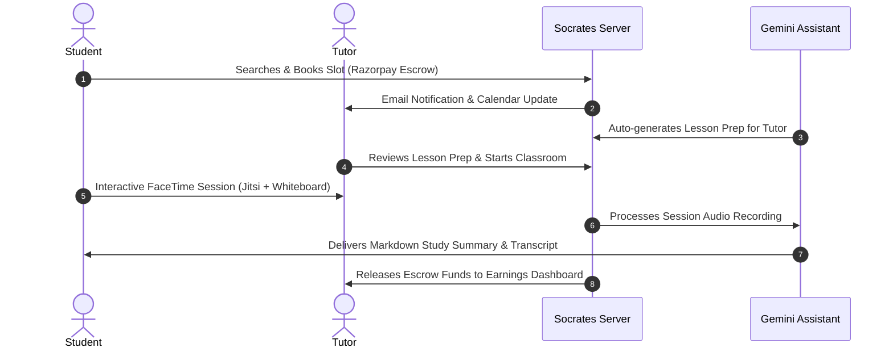

# SOCRATES: STUDENT & TUTOR FEATURE PERSPECTIVES 🧑‍🎓👨‍🏫

This guide outlines the features of the **Socrates** platform from the distinct perspectives of its two primary users: **Students (Users)** and **Tutors**. Each feature is detailed briefly, explaining its purpose, target value, and the underlying tech stack.

---

## 🗺️ 1. STUDENT PERSPECTIVES & FEATURES (User Journey)

From the student's perspective, Socrates is a highly visual, friction-free learning hub where finding, booking, and learning from expert tutors feels like a premium, personalized gallery experience.

### 🧑‍🎓 Student Journey Map:
```
[Sign Up & Interests] ➔ [Search & Filter Tutors] ➔ [View Profile & Schedule] ➔ [Pay & Book] ➔ [Live FaceTime Class] ➔ [Get AI Recaps]
```

### 📋 Student Feature Catalog:

#### 1. Account Creation & Learning Profile
* **What it does:** Students register, verify their email, and select subjects, topics of interest, and learning difficulties.
* **Student Value:** Auto-customizes their landing page feed to show relevant tutors.
* **Tech Stack:** React (Frontend), Node/Express (Backend), MongoDB (User Schema), Nodemailer (OTP Verification).

#### 2. Visual Tutor Search & Filters
* **What it does:** A search page with a persistent search bar and filters (by subject, hourly price range, rating, and tutor availability calendar).
* **Student Value:** Quick discovery of perfect tutors without scrolling through irrelevant listings.
* **Tech Stack:** `{component.search-input}`, `{component.configurator-option-chip}` filters, MongoDB queries.

#### 3. Interactive Tutor Profiles
* **What it does:** Displays tutor bio, introduction videos, star rating histograms, subject specialties, and student comments.
* **Student Value:** Provides high trust and visual proof of tutor quality before spending money.
* **Tech Stack:** `{component.product-tile-light}`, `{component.appstore-review-card}`, Cloudinary (video/photo storage).

#### 4. Flexible Duration Booking & Razorpay Checkout
* **What it does:** Allows booking sessions in flexible lengths (15-min "Quick Doubt" slots, 30-min "Concept Review" slots, or 60-min "Deep Dive" sessions). Payments are pro-rated accordingly.
* **Student Value:** Avoids paying for a full hour when they only need help with a single difficult topic or homework question.
* **Tech Stack:** `{component.calendar-scheduler-genius}`, Razorpay API, Mongoose Booking model with duration intervals.

#### 5. Instant "On-Demand" SOS Call (Ad-hoc Tutoring)
* **What it does:** Students post a single difficult problem. The platform broadcasts it to active, online certified tutors in that subject. A tutor can accept and instantly start a 10-15 minute voice/video call.
* **Student Value:** Get immediate human help on a specific roadblock without scheduling in advance.
* **Tech Stack:** WebSockets (Socket.io), Jitsi room generation, active tutor matching queue.

#### 6. Chat & Messenger
* **What it does:** A direct message terminal to chat with tutors, share homework attachments, and coordinate questions.
* **Student Value:** Keeps communication direct and safe, without giving away private phone numbers.
* **Tech Stack:** Socket.io (real-time chat), `{component.imessage-bubble}` UI, Multer/Cloudinary (file uploads).

#### 7. Live FaceTime Classroom
* **What it does:** An in-browser, high-definition video call room featuring a shared drawing canvas and real-time text editor.
* **Student Value:** Dynamic learning room that lets them draw equations or write code alongside their tutor.
* **Tech Stack:** Jitsi Meet API (video stream), Socket.io (canvas/editor sync), `{component.facetime-video-grid}`.

#### 8. Active Socratic AI Assistant (On-Demand Help)
* **What it does:** An integrated chat bot that uses the Socratic method (asking guiding questions) to help students solve homework problems.
* **Student Value:** Immediate homework help without getting answers copy-pasted for them.
* **Tech Stack:** Google Gemini API (Socratic Prompt Engineering).

#### 9. Automated Session Recaps
* **What it does:** After a class, the student receives a structured markdown summary outlining key topics, homework tasks, and transcripts.
* **Student Value:** Saves time taking notes during class, allowing 100% focus on the tutor.
* **Tech Stack:** Google Gemini API (Transcript summarization), BullMQ (Background job queue).

#### 10. Community Doubt Board & Cost-Split Group Sessions
* **What it does:** Students post specific doubts. If other students have the same issue, they can upvote it or click "Split Session". Tutors can host a group classroom session for up to 5 students on that doubt, auto-splitting the session fee.
* **Student Value:** Reduces individual cost by up to 80% while enabling peer study and group problem-solving.
* **Tech Stack:** Mongoose GroupBooking schema, Socket.io upvote broadcast, Razorpay split-payment logic.

---

## 🗺️ 2. TUTOR PERSPECTIVES & FEATURES (Tutor Journey)

From the tutor's perspective, Socrates is a professional business suite. It simplifies scheduling, handles payments, assists in lesson prep, and hosts classes without needing external tools.

### 👨‍🏫 Tutor Journey Map:
```
[Profile Application] ➔ [Admin Approval] ➔ [Manage Availability] ➔ [Receive Bookings] ➔ [Review AI Lesson Prep] ➔ [Teach Class] ➔ [Track Earnings]
```

### 📋 Tutor Feature Catalog:

#### 1. Professional Application & Credential Portal
* **What it does:** Tutors sign up, upload certifications, diplomas, background checks, and set their hourly rate.
* **Tutor Value:** A clear path to getting certified and listed on the platform.
* **Tech Stack:** React forms (Zod validation), Mongoose (Tutor schema), Multer (file upload).

#### 2. Availability & Slot Configurator
* **What it does:** An interactive calendar grid where tutors configure their availability slots in varying increments (15m, 30m, 60m) and toggle their availability for "Instant SOS On-Demand" calls.
* **Tutor Value:** Tutors can monetize small gaps in their schedule with quick 15-minute doubt-solving sessions, maximizing their earning potential.
* **Tech Stack:** FullCalendar React plugin, Mongoose Availability schema.

#### 3. Dashboard Analytics & Earnings Tracker
* **What it does:** Visual dashboard showing total teaching hours, net earnings, rating stats, and calendar views of upcoming sessions.
* **Tutor Value:** Simple business management to keep track of monthly income.
* **Tech Stack:** Zustand (state), Chart.js/Recharts (visual stats), `{component.store-utility-card}`.

#### 4. Socratic AI Copilot (Lesson Preparer)
* **What it does:** 30 minutes before a session, the AI reviews the student's background and generates a 1-page custom lesson plan for the tutor.
* **Tutor Value:** Reduces lesson preparation time to zero, telling the tutor exactly what the student struggles with.
* **Tech Stack:** Google Gemini API (Historical student review aggregation).

#### 5. Virtual Classroom Management
* **What it does:** Tutors host classes, share screens, draw on the digital whiteboard, and highlight parts of the student's code.
* **Tutor Value:** Eliminates the need to configure Zoom, Skype, or third-party whiteboard tools.
* **Tech Stack:** Jitsi Meet API, custom Socket.io state rooms.

#### 6. Group Webinars & Masterclasses
* **What it does:** Tutors can view high-demand upvoted topics on the Community Doubt Board and schedule a "Group Masterclass" (webinar). Multiple students pay a small ticket fee to join.
* **Tutor Value:** Dramatically increases hourly earnings (e.g. 5 students paying $15 each = $75/hr, compared to their single hourly rate of $40/hr).
* **Tech Stack:** Jitsi webinar mode configuration, ticketed billing service.

#### 7. Stripe / Razorpay Payout System
* **What it does:** Automatically releases tutor payments from escrow into their bank accounts after successful session verification.
* **Tutor Value:** Guaranteed, secure payments for all completed hours.
* **Tech Stack:** Razorpay Transfer API / Stripe Connect, Node cron jobs.

---

## ⚖️ 3. CORE COLLABORATIVE WORKFLOWS (Summary)

The platform is designed to align both perspectives seamlessly through automatic state transitions:

